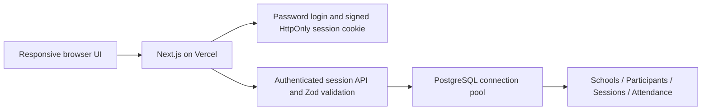

# ClassLedger — Attendance & Class Tracking

A responsive attendance and curriculum application for schools, using Lagos-inspired green, yellow, red and blue accents around a white workspace. This is an independent application, not an official Lagos State service.

## 1. Project setup

Stack: **Next.js 15 + React 19 + TypeScript + Tailwind CSS 4**, server-side **Node.js API routes**, and **PostgreSQL** using `pg`. Vercel hosts the frontend and API; Neon or Supabase can host PostgreSQL. Parameterized SQL, database constraints and atomic transactions protect records. No native database-engine download is required.

```bash
git clone https://github.com/princecoker/Attendance-Register.git
cd Attendance-Register
npm ci
cp .env.example .env
# Edit .env securely; see the configuration table below.
# For local development, after setting a localhost PostgreSQL URL in .env:
npm run db:local
npm run db:migrate
npm run dev
```

Use the existing checkout in Codex cloud tasks; each task is isolated, so no extra Git worktree is needed. Node.js 22 or 24 is recommended; Node 24 was used to validate this application. Docker is only needed for the optional local database. Set the local `DATABASE_URL` and `DIRECT_URL` to your Docker PostgreSQL instance with database `attendance`, user `attendance`, and port `5432`. The local-db helper reads the password without printing it and passes it to Docker Compose.

| Variable         | Purpose                                                                                                               |
| ---------------- | --------------------------------------------------------------------------------------------------------------------- |
| `DATABASE_URL`   | Runtime PostgreSQL connection URL. Use your provider's pooled URL on Vercel and its prescribed TLS parameters.        |
| `DIRECT_URL`     | Direct PostgreSQL URL for migrations; falls back to `DATABASE_URL` when omitted.                                      |
| `ADMIN_PASSWORD` | A strong, unique shared administrator password. Never reuse the local development password in production.             |
| `SESSION_SECRET` | A random secret of at least 32 characters for signing session cookies. Generate securely with `openssl rand -hex 32`. |

Keep secrets in an ignored `.env` locally and in Vercel environment variables for deployment. Never commit credentials. The application fails closed when administrator authentication is unconfigured.

Architecture:



The dashboard shows today's sessions in **Africa/Lagos**, global attendance statistics, and recent records. Log Session captures curriculum and participant statuses. History supports date/week filters, pagination, full topic and participant details, and CSV export across all matching pages. Loading, empty, validation and database-error states are explicit; no invented sample attendance is displayed.

## 2. Database schema

The complete executable schema is [database/migrations/001_initial.sql](database/migrations/001_initial.sql). Tables:

| Model          | Fields and relationships                                                                                                                                                             |
| -------------- | ------------------------------------------------------------------------------------------------------------------------------------------------------------------------------------ |
| `schools`      | UUID `id`, unique `name`                                                                                                                                                             |
| `participants` | UUID `id`, `school_id` → schools, `name`; unique name within each school                                                                                                             |
| `sessions`     | UUID `id`, `school_id` → schools, `date` (DATE), `week` (1–53), `arrival_time` (TIME), optional `departure_time` (TIME), `topic` (TEXT), `created_at`                                |
| `attendance`   | UUID `id`, `session_id` → sessions, `participant_id` → participants, `status` (PRESENT / ABSENT / LATE), optional individual arrival/departure times; unique participant per session |

Session times are local Lagos wall-clock times. A session starts and finishes on the same calendar day; overnight sessions are rejected. Missing departure means an open session. Absent participants cannot have times. Participant departure requires arrival. Attendance rate is `(present + late) / all attendance entries`; it measures session participation, not distinct people. The current identity model distinguishes participants by their school and exact name; institutions with duplicate names should add stable student identifiers in a follow-up.

The migration runner [scripts/migrate.mjs](scripts/migrate.mjs) applies versioned SQL once, uses a transaction and advisory lock, and records completed migrations in `schema_migrations`.

## 3. Backend API

Core endpoints are in [app/api/sessions/route.ts](app/api/sessions/route.ts); SQL access is in [lib/db.ts](lib/db.ts), and input rules are in [lib/validation.ts](lib/validation.ts).

| Method and path                                   | Behavior                                                                                                                    |
| ------------------------------------------------- | --------------------------------------------------------------------------------------------------------------------------- |
| `POST /api/auth`                                  | Sign in using `{ "password": "..." }`. Issues an eight-hour signed, HttpOnly, SameSite=Strict cookie, Secure in production. |
| `POST /api/logout`                                | Delete the session cookie.                                                                                                  |
| `POST /api/sessions`                              | Validate input and atomically save a school, participants, session and attendance; returns 201.                             |
| `GET /api/sessions?week=2&date=2026-10-08&page=1` | Return matching sessions (50 per page), total, global statistics and today's sessions. Filters are optional.                |

All session endpoints require authentication. Mutations require a matching Origin and Host. Invalid input returns 400, missing authentication 401, rejected origins 403, and unavailable database 503. Database errors are not exposed to clients.

Example session request:

```json
{
  "school": "Lagos City Secondary School",
  "date": "2026-10-08",
  "week": 2,
  "arrivalTime": "09:00",
  "departureTime": "11:00",
  "topic": "Fractions, decimals and practical exercises",
  "attendance": [
    {
      "name": "Ada Coker",
      "status": "PRESENT",
      "arrivalTime": "09:00",
      "departureTime": "11:00"
    },
    {
      "name": "Tunde Bello",
      "status": "LATE",
      "arrivalTime": "09:15",
      "departureTime": "11:00"
    },
    { "name": "Bisi Ade", "status": "ABSENT" }
  ]
}
```

The shared administrator login is suitable for a small, trusted team. Separate instructor accounts, school-level permissions, audit trails, password recovery and distributed login throttling are not implemented. Enable Vercel Firewall login rate limits before public deployment; use an identity provider and role-based access control when expanding to multiple independent schools.

## 4. Frontend UI

The main form component is [components/log-session.tsx](components/log-session.tsx). It includes school, date, week, arrival/departure, topic, participant rows, status selection, individual times, and current-time clock buttons. Required fields, backend validation errors, saving state and success confirmation are displayed. Clock buttons fill the new-session form; sessions are saved on **Save session**. Existing records are currently read-only.

The full dashboard and reports interface is [components/workspace.tsx](components/workspace.tsx); theme and reusable UI classes are in [app/globals.css](app/globals.css). The form renders in the workspace as:

```tsx
import LogSession from "@/components/log-session";

<LogSession onSaved={() => void reloadSessions()} />;
```

The central workspace stays white; green provides primary actions, yellow highlights late attendance, red marks absence/errors, and blue accents statistics. Mobile navigation, stacked forms and scrollable reports support small screens.

## Verification

```bash
npm test                 # Validation rules
npm run lint             # TypeScript checking
npm run build            # Production build
npm audit                # Dependency advisories
npm run start            # Start the production build
npm run test:smoke       # In another terminal, against the running server
```

The smoke test uses `.env` and a disposable local database, exercises authentication, origin checks, validation, all attendance statuses, persistence, filters, dashboard statistics, real-browser form submission, clock buttons, CSV download and mobile width. It creates uniquely named test-school records and deletes only those records in cleanup. By default it uses `/usr/bin/chromium`; use `CHROMIUM_PATH` for your installed browser. Browser screenshots are written under `/tmp`, never committed.

## GitHub and Vercel hosting

1. Push this application to your GitHub repository.
2. In Vercel, import `princecoker/Attendance-Register` as a Next.js project. Build settings are provided in `vercel.json`.
3. Create/connect a Neon or Supabase PostgreSQL database. Add `DATABASE_URL`, `DIRECT_URL`, `ADMIN_PASSWORD` and `SESSION_SECRET` securely in Vercel for the appropriate environments. Use a different database for preview deployments to isolate real attendance data.
4. Apply the migration **once to the target database**, using its securely configured environment: `npm run db:deploy`. For a local `.env` connection, use `npm run db:migrate`.
5. Deploy on Vercel. Sign in, save a test session, verify it in history, and delete any temporary test records through your database administration tool.

Migrations are deliberately not run during every Vercel build. Rotate local/test credentials before production, enable database backups, and configure login rate limits. Vercel Git integration can automatically deploy future pushes after the project is connected. Live hosting requires account access and a provisioned database; committing deployment files alone does not create these services.
